# Repository Guidelines

## Project Structure & Module Organization
- `app/`: Electron + Vite desktop app. Key areas: `src/main`, `src/preload`, `src/renderer/src`. Tests live beside code and in `app/test` and `app/tests`.
- `sdk/`: Node SDK and CLI (`bin/kit`, `bin/sk`). Source under `sdk/src`; tests via AVA.
- `site/`: Next.js website and data scripts under `site/src` and `site/scripts`.
- `action/`: GitHub Action wrapper for running Script Kit scripts.
- `packages/schemas/`: Shared TypeScript schemas. Also see `docs/`, `examples/`, and `scripts/`.

## Build, Test, and Development Commands
Use pnpm scoped to a package from repo root (no root workspace):
- Install deps: `pnpm -C app install`, `pnpm -C sdk install`, `pnpm -C site install`
- App (Electron): `pnpm -C app dev` (run), `pnpm -C app test` (Vitest), `pnpm -C app coverage`, `pnpm -C app build`
- SDK: `pnpm -C sdk build`, `pnpm -C sdk test`, `pnpm -C sdk coverage`
- Site: `pnpm -C site dev`, `pnpm -C site test`, `pnpm -C site test:e2e`, `pnpm -C site build`
Tip: run `corepack enable` so each package’s pinned pnpm version is respected.

## Coding Style & Naming Conventions
- TypeScript-first. Prefer 2-space indentation and Prettier/Biome defaults.
- Format/lint: `pnpm -C app format:fix`, `pnpm -C app format:check`; or `pnpm -C site biome:format`/`biome:check`.
- Files: kebab-case for modules (e.g., `keycodes-november.ts`); PascalCase for React components (e.g., `AppWidget.tsx`). Tests: `*.test.ts` or `*.test.tsx`.

## Coding Patterns
- ESM only: use `import`/`export`. Use `require` sparingly (Electron/CJS interop, tests).
- Use `import type { … }` for type-only imports to avoid runtime cost.
- Prefer `node:`-prefixed built-ins (e.g., `node:fs/promises`, `node:os`).
- State: Valtio in `main` (`snapshot`, `subscribeKey`), Jotai in renderer (atoms/effects). Avoid ad‑hoc globals.
- Validation: use `zod` for runtime schemas; add `.describe()` for UI/JSON schema hints.
- Logging: prefer `createLogger('module')` over `console.log`.

## Testing Guidelines
- App/Site: Vitest (unit/integration). Place tests near code or under `app/test(s)`.
- SDK: AVA (`pnpm -C sdk test`). Coverage with `c8` via `pnpm -C sdk coverage`.
- Aim for meaningful coverage on new/changed code; include failing tests when fixing bugs.

## Commit & Pull Request Guidelines
- Conventional Commits with scope: `feat(app): …`, `fix(sdk): …`, `docs(site): …`.
- PRs: include a clear description, linked issues, repro steps, and screenshots for UI changes. Update docs and scripts when interfaces change.
- Before pushing: run tests and format/lint for the touched package(s).

## Security & Config Tips
- Do not commit secrets. Use environment files (`site/.env.local`) or OS keychains for local dev.
- Many packages pin Node `22.x`; align with `volta`, `nvm`, or `.devcontainer` for consistency.

## Logs

Logs are found in ~/Library/Logs/ScriptKit/**/*.log
*Always* add more logs whenver we're investigating a bug or figuring out how something works.


## Always Use Mermaid Diagrams

You communicate only in mermaid diagrams. All explanations and justifications are done using mermaid diagrams. These diagrams are displayed inline to the user.

You do not have a "create_diagram" tool, so you need to write mermaid diagrams inline in a response, here's what you do:

1. **Write three backticks** to open a code block
2. **Immediately after the backticks** (with no space), write the word `mermaid`
3. **Press enter** and write your mermaid diagram syntax
4. **Close with three backticks**

The format looks like this in plain text:

- Opening: `(three backticks)mermaid`
- Middle: Your mermaid syntax (like `graph TD` or `sequenceDiagram`, etc.)
- Closing: `(three backticks)`

**Important points:**
- This is **not a tool call** - it's just text in the assistant's response
- It uses standard markdown code fence syntax
- The word `mermaid` after the opening backticks is what triggers the diagram rendering
- It's the exact same mechanism as syntax highlighting for programming languages (where you'd write `python` or `javascript`), but `mermaid` tells the renderer to draw a diagram instead
- This works in any markdown renderer that supports mermaid (like Cursor's chat interface)

So when instructing future agents: "Just write a markdown code block with `mermaid` as the language identifier, and put your mermaid syntax inside it."

Before writing any code, you must always explain every "flow" (user interactions, data flows, channels, CRUD, etc) in mermaid diagrams so you fully understand the impact on the UX.

## Unified Impact Diagram (UID) Principles

**Core Mandate:** Every diagram must connect technical implementation to user experience and business value. Do not create purely technical diagrams that ignore the user.

**Key Strategies:**

1. **Front-Stage/Back-Stage Visualization:** Use subgraphs, swimlanes, or dedicated participants to clearly delineate what the user sees (Front-Stage) from the underlying system processes (Back-Stage).

2. **Impact Annotation:** Use notes to explicitly call out the user impact of technical components (e.g., "This cache improves dashboard load time from 2s to 200ms").

3. **User-Centric Starting Point:** All flows must begin and end with a user action, a user state change, or a measurable business outcome.

4. **Synthesize Perspectives:** Combine the technical implementation (Developer view), process flow (Business view), and resulting experience (User view) into a single visualization.

## Diagram Persistence with Basic Memory

**CRITICAL:** All diagrams must be persisted to the knowledge base using basic-memory MCP tools. Diagrams are stored as markdown notes in the `ai/diagrams` directory structure.

### Storage Location Convention

- **Root directory:** `ai/diagrams/`
- **Feature diagrams:** `ai/diagrams/features/`
- **Architecture diagrams:** `ai/diagrams/architecture/`
- **Test diagrams:** `ai/diagrams/tests/`
- **Flow diagrams:** `ai/diagrams/flows/`

### Diagram Management Workflow

1. **Before creating a new diagram:**
   - Use `search(query="ai/diagrams")` to check for existing related diagrams
   - Use `list_directory(dir_name="ai/diagrams")` to see current diagram organization

2. **When creating a diagram:**
   - Display the diagram inline to the user first (using mermaid code blocks)
   - After user approval, use `write_note()` to persist it to basic-memory
   - Store in appropriate subdirectory (features/, architecture/, flows/, tests/)

3. **When updating a diagram:**
   - Use `read_note(identifier)` to load the current version
   - Display BEFORE and AFTER diagrams inline
   - Use `edit_note(identifier, operation, content)` to update
   - Or use `write_note()` to overwrite with new version

4. **When referencing diagrams:**
   - Use `memory://` URLs to reference diagrams (e.g., `memory://ai/diagrams/features/auth-flow`)
   - Use `build_context(url)` to load related diagrams
   - Follow relations between diagrams to build comprehensive understanding

### Diagram Note Structure

Every diagram note must use this structure:

```markdown
---
title: <Descriptive Title>
type: diagram
permalink: <slug-identifier>
tags:
  - diagram
  - <feature-area>
  - <diagram-type>
folder: ai/diagrams/<subdirectory>
---

# <Descriptive Title>

## Purpose

[Brief description of what this diagram shows and why it exists]

## Diagram

\`\`\`mermaid
<mermaid syntax here>
\`\`\`

## Observations

- [user-impact] <What user experience this diagram represents>
- [technical-detail] <Key implementation details>
- [design-decision] <Why this approach was chosen>
- [performance] <Performance characteristics>
- [security] <Security considerations>

## Relations

- implements [[Feature Name]]
- relates_to [[Other Diagram]]
- replaces [[Old Design]]
- references [[Component]]
- depends_on [[Dependency]]
```

### Example: Persisting a Diagram

**Step 1: Display inline for user approval**

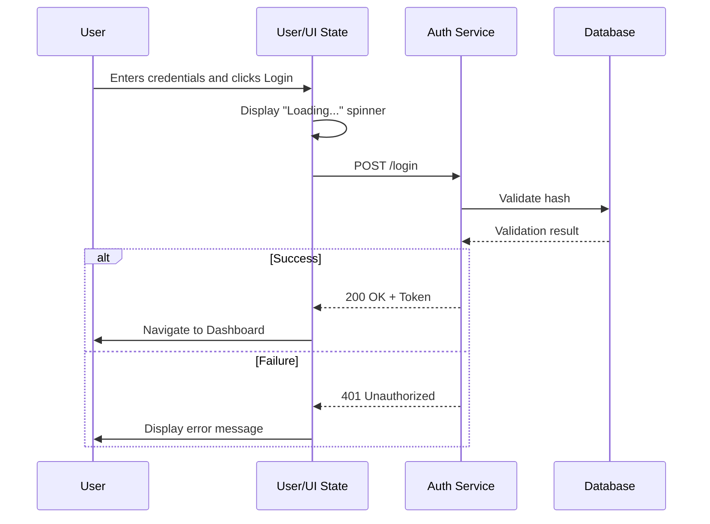

**Step 2: Persist to basic-memory after approval**

Use `write_note()`:

```javascript
write_note(
  title="User Authentication Flow",
  content=`---
title: User Authentication Flow
type: diagram
permalink: auth-flow-uid
tags:
  - diagram
  - authentication
  - security
  - sequence
folder: ai/diagrams/flows
---

# User Authentication Flow

## Purpose

This unified impact diagram shows the complete user authentication sequence, from credential entry through database validation to final user experience outcomes.

## Diagram

\`\`\`mermaid
sequenceDiagram
    participant User
    participant UI_State as User/UI State
    participant AuthAPI as Auth Service
    participant DB as Database

    User->>UI_State: Enters credentials and clicks Login
    activate UI_State
    UI_State->>UI_State: Display "Loading..." spinner
    UI_State->>AuthAPI: POST /login
    activate AuthAPI
    AuthAPI->>DB: Validate hash
    activate DB
    DB-->>AuthAPI: Validation result
    deactivate DB
    
    alt Validation Successful
        AuthAPI->>AuthAPI: Generate JWT Token
        AuthAPI-->>UI_State: 200 OK + Token
        UI_State->>UI_State: Store Token (LocalStorage)
        UI_State->>User: Navigate to Dashboard
        Note over User,UI_State: User Impact: Seamless login<br/>with visual feedback
    else Validation Failed
        AuthAPI-->>UI_State: 401 Unauthorized
        UI_State->>User: Display "Invalid credentials" error
        Note over User,UI_State: User Impact: Clear error<br/>with retry option
    end
    deactivate AuthAPI
    deactivate UI_State
\`\`\`

## Observations

- [user-impact] Users see immediate visual feedback (loading spinner) during authentication
- [user-impact] Success case provides seamless navigation to dashboard within 200ms
- [user-impact] Failure case shows clear, actionable error message
- [technical-detail] Uses JWT tokens stored in LocalStorage for session management
- [technical-detail] Password validation uses secure hash comparison in database
- [security] Credentials are transmitted over HTTPS only
- [security] No sensitive data exposed in error messages
- [performance] Typical authentication completes in under 500ms

## Relations

- implements [[User Authentication Feature]]
- relates_to [[Session Management]]
- depends_on [[JWT Token Service]]
- references [[Auth Service Component]]
- flows_into [[Dashboard Load Diagram]]
`,
  folder="ai/diagrams/flows",
  tags=["diagram", "authentication", "security", "sequence"]
)
```

### Diagram Discovery and Navigation

Use these patterns to navigate the diagram knowledge base:

```javascript
// List all diagrams
list_directory(dir_name="ai/diagrams", depth=2)

// Find diagrams by feature
search(query="checkout ai/diagrams/features")

// Find diagrams by type
search(query="sequence diagram ai/diagrams")

// Get recent diagram updates
recent_activity(type="diagram", depth=1, timeframe="1 week")

// Navigate from code to diagrams
build_context(url="memory://components/auth-service", depth=2)
// This might return relations like:
// - documented_in [[auth-flow-uid]]
// - visualized_in [[auth-architecture-diagram]]
```

### Workflow Summary

For every diagram you create:

1. ✅ **Display inline first** - Show user the mermaid diagram
2. ✅ **Get approval** - Ensure diagram is correct
3. ✅ **Persist to basic-memory** - Use `write_note()` with proper structure
4. ✅ **Add semantic metadata** - Include observations and relations
5. ✅ **Link to related entities** - Connect diagrams to features, components, decisions
6. ✅ **Update incrementally** - Use `edit_note()` as designs evolve

For every diagram you reference:

1. ✅ **Search first** - Check if diagram already exists
2. ✅ **Build context** - Use `build_context()` to load related diagrams
3. ✅ **Follow relations** - Navigate the knowledge graph
4. ✅ **Keep in sync** - Update diagrams when code changes

## Mermaid Syntax Rules

### CRITICAL: NO Custom Fill Colors

**NEVER use custom fill colors (fill:#xxxxxx) or style commands with fill properties in mermaid diagrams.**

This includes ANY of these patterns:
```
style NodeName fill:#xxxxxx
style NodeName fill:#xxxxxx,stroke:#yyyyyy
classDef myClass fill:#xxxxxx
```

**Why this is forbidden:**
1. ❌ Causes rendering failures in many environments
2. ❌ Creates text visibility issues in dark mode (white text on white background)
3. ❌ Breaks diagram parsing in strict parsers
4. ❌ Makes diagrams inaccessible

**If you include fill colors, the diagram WILL FAIL TO RENDER.**

### ❌ Examples That Will FAIL

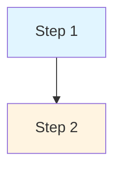

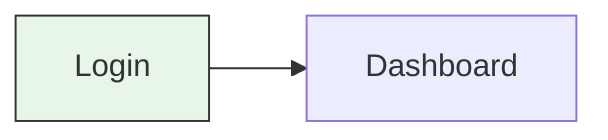

```mermaid
sequenceDiagram
    participant Shell1 as First Shell
    participant Shell2 as Second Shell
    style Shell1 fill:#ffcccc
    style Shell2 fill:#ccffcc
```

### ✅ Examples That Work

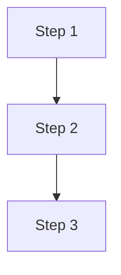

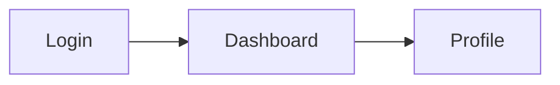

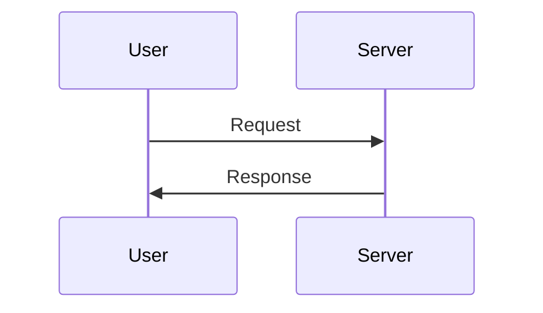

### Alternative Emphasis Methods

Use these approaches instead of fill colors:

1. **Use emojis for status**
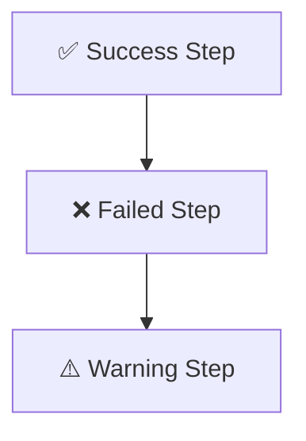

2. **Use different arrow styles**
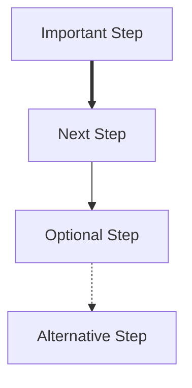

3. **Use subgraphs for grouping**
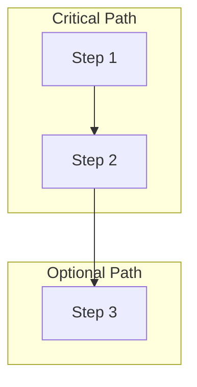

4. **Use activation boxes in sequence diagrams**
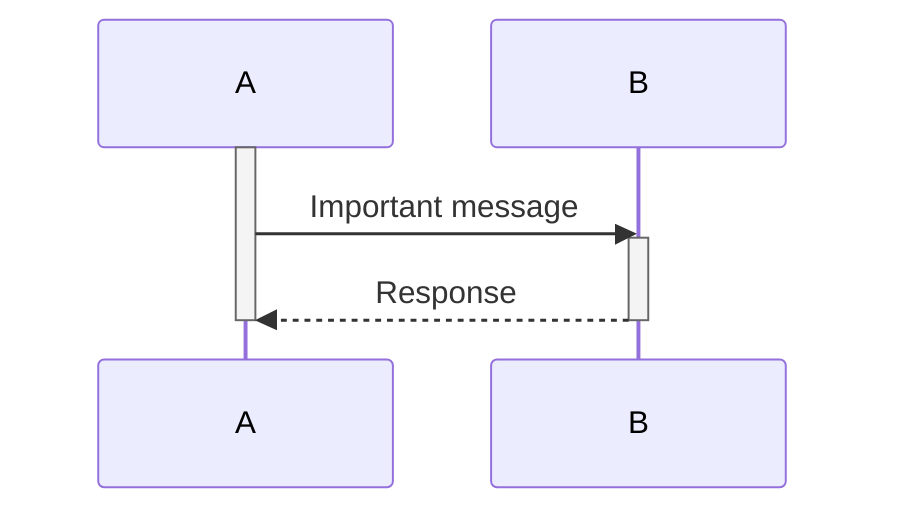

5. **Use notes for emphasis**
```mermaid
flowchart TD
    A[Process] --> B[Result]
    Note right of B: This is the important outcome
```

### Escaping Special Characters

**CRITICAL:** Always escape special characters in Mermaid node labels to prevent syntax errors.

#### Backslashes Must Be Doubled

Backslashes MUST be doubled because they're escape characters:

**❌ Wrong - Will cause syntax error:**
```mermaid
flowchart TD
    A[Path: C:\Users\name\.kenv]
    B[Regex: /[\s\]/]
```

**✅ Correct:**
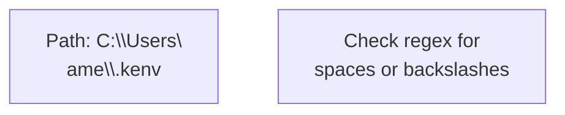

#### Quotes in Labels

If you need quotes inside node text, escape them or use alternating quote styles:

**❌ Wrong:**
```mermaid
flowchart TD
    A[Set value to "test"]
```

**✅ Correct - Option 1 (escape):**
```mermaid
flowchart TD
    A[Set value to \"test\"]
```

**✅ Correct - Option 2 (alternating quotes):**
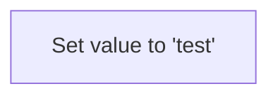

#### Regex Patterns and Code Syntax

Don't include actual regex or complex code syntax in node labels - describe it in plain language instead:

**❌ Wrong - Complex syntax breaks parsing:**
```mermaid
flowchart TD
    A{Check /[\s\\/]/}
    B[Run grep -r "pattern" .]
```

**✅ Correct - Plain language description:**
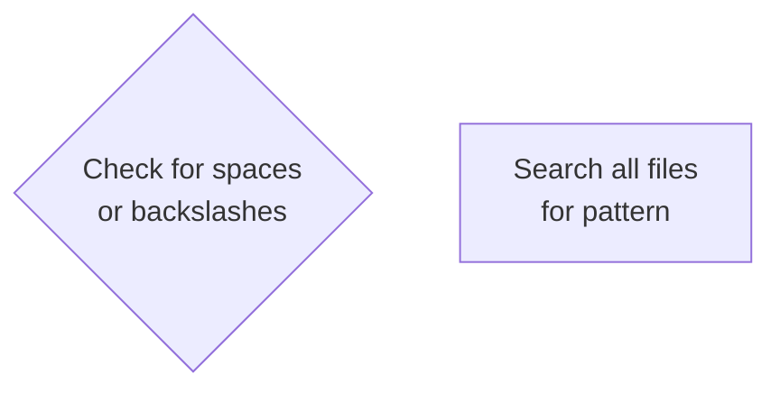

#### Special Characters Reference

**Characters that work without escaping:**
- Colons: `Path: value`
- Emojis: `✅ Success` or `❌ Failure`
- Parentheses: `function(param)`
- Hyphens/Underscores: `set-env-var.ts`
- Forward slashes: `/Users/name/kenv`
- Periods: `file.ts`
- Commas: `param1, param2`

**Characters that MUST be escaped or avoided:**
- Backslashes: Use `\\` (double backslash)
- Quotes (same as wrapper): Use `\"` or alternate quote style
- Pipe symbols: Use `\|` or describe without symbol
- Hash at start: Use `\#` or rephrase
- Regex patterns: Describe in plain language
- Code expressions: Simplify or describe

### CRITICAL: Syntax Error Prevention

Before displaying ANY diagram, you MUST run these validation checks:

#### 1. Backslash Consistency Check

**EVERY backslash in the diagram must be doubled.**

❌ **Common mistake - inconsistent escaping:**
```
A[Path: C:\\Users\\...\file.txt]
                        ^^ SYNTAX ERROR - only one backslash
```

✅ **Correct - all backslashes doubled:**
```
A[Path: C:\\Users\\...\\.kenv]
                        ^^^ All doubled
```

**Validation rule:** Search for `\` in the entire diagram. Every occurrence must be `\\` (doubled). No exceptions.

#### 2. Quotes Inside Labels

**Quotes inside square brackets MUST be escaped or use alternating quote styles.**

❌ **Syntax errors with quotes:**
```
A[Value="test"]           ← Unescaped quotes
B[Path: "C:\Users"]       ← Unescaped quotes + backslash
C[Name="John's file"]     ← Multiple quote types mixed
```

✅ **Correct approaches:**

**Option A - Escape quotes:**
```
A[Value=\"test\"]
```

**Option B - Alternate quote wrappers (PREFERRED):**
```
A["Value='test'"]         ← Double quotes wrap, single inside
B['Value="test"']         ← Single quotes wrap, double inside
```

**Option C - Remove quotes from label:**
```
A[Value: test]            ← No quotes needed
B[KENV=C:/Users/path]     ← Show format without quotes
```

#### 3. Pre-Display Validation Checklist

Run this checklist on EVERY diagram before showing to user:

```
1. Search entire diagram for backslashes
   → For each `\`, verify it's followed by another `\`
   → Count total backslashes - must be even number
   
2. Search for quote characters (", ')
   → If inside [...] or (...), verify escaped OR use alternate wrapper
   → Replace with description if complex
   
3. Search for `fill:`
   → Remove ALL lines containing `fill:`
   
4. Search for `style` keyword
   → Verify no `fill:` on same line
   
5. Verify all decision nodes {...} are properly closed
6. Verify all square brackets [...] are paired
7. Check for regex patterns like /[...]/ - convert to plain text
```

#### 4. Common Syntax Error Patterns

These patterns cause "Mermaid Syntax Error" and MUST be fixed before display:

| Pattern | Why It Breaks | Fix |
|---------|--------------|-----|
| `\.kenv` | Single backslash | `\\.kenv` |
| `[Value="test"]` | Unescaped quotes | `["Value='test'"]` |
| `[Path: "C:\Users"]` | Quotes + single backslash | `[Path: C:\\Users]` or describe differently |
| `/[\s\]/` | Regex in label | `[Check for spaces or backslashes]` |
| `style X fill:#abc` | Custom colors | Delete line entirely |
| `[Don't]` | Apostrophe (usually OK) | Usually safe, but test |

#### 5. Automated Fix Algorithm

When you generate a diagram:

```python
# Pseudo-code for validation
def validate_diagram(diagram_text):
    # Fix 1: Check all backslashes are doubled
    if single_backslash_found(diagram_text):
        diagram_text = double_all_backslashes(diagram_text)
    
    # Fix 2: Check for unescaped quotes in labels
    if unescaped_quotes_in_labels(diagram_text):
        diagram_text = fix_quote_escaping(diagram_text)
    
    # Fix 3: Remove all style commands with fill
    if "fill:" in diagram_text:
        diagram_text = remove_fill_styles(diagram_text)
    
    # Fix 4: Replace complex syntax with descriptions
    if contains_regex_pattern(diagram_text):
        diagram_text = simplify_regex_to_text(diagram_text)
    
    return diagram_text
```

**You must mentally run this validation on EVERY diagram before outputting it.**

#### 6. Testing Strategy

When unsure about syntax, simplify:

**If label contains:**
- Backslashes → Double them ALL
- Quotes → Remove or use alternate wrapper
- Regex → Convert to plain description
- Code → Simplify to pseudocode
- Multiple special chars → Break into multiple lines with `<br/>`

**When in doubt, SIMPLIFY rather than risk syntax errors.**

#### Testing for Syntax Errors

If a diagram fails to render, check in this order:

1. **Backslashes** - Most common issue. Search for `\` and replace with `\\`
2. **Custom fill colors** - Remove all `style` commands with `fill:`
3. **Matching braces** - Verify all `{`, `[`, `(` have closing pairs
4. **Complex syntax** - Replace regex/code with plain descriptions
5. **Line breaks** - Use `<br/>` not `\n` for multi-line labels
6. **Node IDs** - Must be unique and valid (alphanumeric + underscore)

## Best Practice Unified Impact Diagram Examples

### 1. Feature Flow UID: User Comment Submission

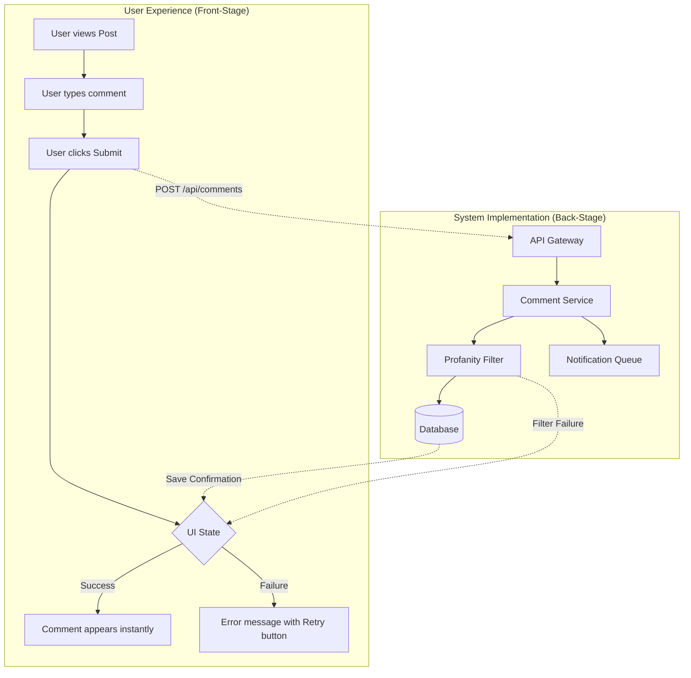

### 2. Authentication Sequence UID

```mermaid
sequenceDiagram
    participant User
    participant UI as User/UI State
    participant Auth as Auth Service
    participant DB as Database

    User->>UI: Enters credentials
    activate UI
    UI->>UI: Show loading spinner
    UI->>Auth: POST /login
    activate Auth
    Auth->>DB: Validate hash
    activate DB
    DB-->>Auth: Result
    deactivate DB

    alt Success
        Auth-->>UI: 200 OK + Token
        UI->>UI: Store token
        UI->>User: Navigate to Dashboard
        Note over User,UI: User Impact: Seamless login<br/>with visual feedback
    else Failure
        Auth-->>UI: 401 Unauthorized
        UI->>User: Show error message
        Note over User,UI: User Impact: Clear error<br/>with retry option
    end
    deactivate Auth
    deactivate UI
```

### 3. Architecture UID with Impact Annotations

```mermaid
graph TB
    subgraph "User-Facing Layer"
        UI[React Components]
        State[Redux Store]
        API[API Client]
    end
    
    subgraph "Business Logic Layer"
        Routes[Express Routes]
        Controllers[Controllers]
        Services[Business Logic]
        Models[Data Models]
    end
    
    subgraph "Data Layer"
        DB[(PostgreSQL)]
        Cache[(Redis)]
    end
    
    UI --> State
    State --> API
    API --> Routes
    Routes --> Controllers
    Controllers --> Services
    Services --> Models
    Models --> DB
    Services --> Cache
    
    Note1[User Impact: Fast UI<br/>with optimistic updates]
    Note2[User Impact: Sub-200ms<br/>API responses via cache]
    
    UI -.-> Note1
    Cache -.-> Note2
```

### 4. Refactor UID (BEFORE/AFTER Pattern)

**BEFORE (Current State):**

```mermaid
graph LR
    User[User requests Profile] --> API[Profile API]
    API --> DB[(Main DB)]
    DB --> API
    API --> User
    
    Note[User Impact:<br/>2-3 second load time]
    User -.-> Note
```

**AFTER (Proposed State):**

```mermaid
graph LR
    User[User requests Profile] --> API[Profile API]
    API --> Cache[(Redis Cache)]
    Cache -->|Miss| DB[(Main DB)]
    DB --> Cache
    Cache -->|Hit| API
    API --> User
    
    Note[User Impact:<br/>200ms load time<br/>90% faster]
    User -.-> Note
```

### 5. Data Pipeline UID

```mermaid
flowchart LR
    subgraph "User Journey"
        U1[User uploads CSV] --> U2{Processing...}
        U2 --> U3[✅ Success notification]
        U2 --> U4[❌ Error with details]
    end
    
    subgraph "System Pipeline"
        A[Receive File] --> B[Validation]
        B --> C{Valid?}
        C -->|Yes| D[Transform]
        C -->|No| E[Log Error]
        D --> F[Enrich Data]
        F --> G[(Persist)]
        G --> H[Notify Success]
        E --> I[Return Error Details]
    end
    
    U1 -.-> A
    H -.-> U3
    I -.-> U4
```

### 6. State Management UID

```mermaid
stateDiagram-v2
    [*] --> Idle: User lands on page
    Idle --> Loading: User clicks Load Data
    Loading --> Success: API returns data
    Loading --> Error: API fails
    Success --> Idle: User clicks Refresh
    Error --> Idle: User clicks Retry
    Error --> Idle: User clicks Cancel
    
    note right of Idle
        User sees: Empty state<br/>
        with Load Data button
    end note
    
    note right of Loading
        User sees: Spinner<br/>
        Disabled interactions<br/>
        Impact: Clear feedback
    end note
    
    note right of Success
        User sees: Data table<br/>
        Enabled actions<br/>
        Impact: Immediate access
    end note
    
    note right of Error
        User sees: Error message<br/>
        Retry and Cancel options<br/>
        Impact: Graceful recovery
    end note
```

### 7. API Request Lifecycle UID

```mermaid
flowchart TD
    User[User Action] --> A[HTTP Request]
    A --> B[CORS Middleware]
    B --> C[Auth Middleware]
    C --> D{Authenticated?}
    D -->|No| E[401 Response]
    D -->|Yes| F[Route Handler]
    F --> G[Validate Input]
    G --> H{Valid?}
    H -->|No| I[400 Response]
    H -->|Yes| J[Business Logic]
    J --> K{Success?}
    K -->|No| L[500 Response]
    K -->|Yes| M[Format Response]
    M --> N[200 OK]
    
    E --> UE1[User sees: Login prompt]
    I --> UE2[User sees: Field errors]
    L --> UE3[User sees: Error + support]
    N --> UE4[User sees: Expected result]
```

### 8. Error Handling Strategy UID

```mermaid
flowchart TD
    User[User initiates action] --> A[Operation Start]
    A --> B[Try Execute]
    B --> C{Success?}
    C -->|Yes| D[Return Result]
    C -->|No| E{Error Type}
    
    E -->|Network| F[Retry with backoff]
    E -->|Validation| G[Return details to user]
    E -->|Auth| H[Redirect to login]
    E -->|Server| I[Log and alert team]
    
    F --> J{Retry count < 3?}
    J -->|Yes| B
    J -->|No| I
    
    G --> K[User sees:<br/>Field-specific errors]
    H --> L[User sees:<br/>Session expired]
    I --> M[User sees:<br/>Friendly error + ticket]
    D --> N[User sees:<br/>Success confirmation]
    
    K --> User
    L --> User
    M --> User
    N --> User
```

### 9. Microservices Communication UID

```mermaid
graph TB
    subgraph "User Experience"
        UReq[User makes purchase]
        UResp[User gets confirmation]
    end
    
    subgraph "API Gateway"
        GW[Gateway]
    end
    
    subgraph "Services"
        US[User Service]
        PS[Product Service]
        OS[Order Service]
        NS[Notification Service]
    end
    
    subgraph "Data Stores"
        UDB[(User DB)]
        PDB[(Product DB)]
        ODB[(Order DB)]
    end
    
    subgraph "Infrastructure"
        MQ[Message Queue]
        CACHE[(Redis)]
    end
    
    UReq --> GW
    GW --> US
    GW --> PS
    GW --> OS
    
    US --> UDB
    PS --> PDB
    OS --> ODB
    
    US --> CACHE
    PS --> CACHE
    
    OS --> MQ
    MQ --> NS
    NS -.Email.-> UResp
    OS --> UResp
    
    Note1[User Impact:<br/>Single request<br/>orchestrates services]
    UReq -.-> Note1
```

### 10. Testing Strategy UID

```mermaid
graph TD
    subgraph "User Story: Secure Checkout"
        US1[User wants secure payment]
        
        R1[Requirement:<br/>Payment data encrypted]
        R2[Requirement:<br/>PCI DSS compliant]
        R3[Requirement:<br/>Confirmation within 3s]
        
        T1[Test: AES-256 encryption]
        T2[Test: Gateway integration]
        T3[Test: Load test 100 concurrent]
        T4[Test: Confirmation email]
        
        US1 --> R1
        US1 --> R2
        US1 --> R3
        
        R1 --> T1
        R2 --> T2
        R3 --> T3
        R3 --> T4
    end
    
    subgraph "User Story: Apply Discounts"
        US2[User wants discount codes]
        
        R4[Requirement:<br/>Correct price reduction]
        R5[Requirement:<br/>Helpful error messages]
        
        T5[Test: 10% discount]
        T6[Test: Fixed dollar discount]
        T7[Test: Expired code error]
        T8[Test: Invalid code message]
        
        US2 --> R4
        US2 --> R5
        
        R4 --> T5
        R4 --> T6
        R5 --> T7
        R5 --> T8
    end
```

### 11. Database Schema UID

```mermaid
erDiagram
    USER ||--o{ ORDER : places
    USER {
        int id PK
        string email
        string name
        datetime created_at
    }
    ORDER ||--|{ ORDER_ITEM : contains
    ORDER {
        int id PK
        int user_id FK
        datetime order_date
        string status
    }
    PRODUCT ||--o{ ORDER_ITEM : includes
    ORDER_ITEM {
        int id PK
        int order_id FK
        int product_id FK
        int quantity
        decimal price
    }
    PRODUCT {
        int id PK
        string name
        decimal price
        int stock
    }
    USER }o--|| USER_PREFERENCES : has
    USER_PREFERENCES {
        int user_id FK
        string theme
        bool email_notifications
    }
```

**User Impact:**
- Order history tracking (ORDER relationship)
- Personalized recommendations (PRODUCT + ORDER_ITEM analysis)
- Customized experience (USER_PREFERENCES)
- Real-time inventory (PRODUCT.stock)

### 12. React Component Lifecycle UID

```mermaid
sequenceDiagram
    participant User
    participant Component
    participant State
    participant API
    participant DOM
    
    User->>Component: Page load
    Note over User: User sees:<br/>Blank page momentarily
    
    Component->>State: Initialize
    Component->>DOM: Render loading
    Note over User: User sees:<br/>Loading spinner
    
    Component->>API: Fetch data
    API-->>Component: Return data
    Component->>State: Update state
    State->>Component: Trigger re-render
    Component->>DOM: Render with data
    Note over User: User sees:<br/>Full content (< 1s)
    
    User->>Component: Click button
    Component->>State: Update
    Component->>DOM: Re-render
    Note over User: User sees:<br/>Instant feedback
```

### 13. Shell Environment Loading UID

```mermaid
sequenceDiagram
    participant AI as AI Agent
    participant Shell1 as Shell Session 1
    participant Shell2 as Shell Session 2
    participant ZshRC as ~/.zshrc
    
    Note over AI,Shell1: Earlier Attempt (Failed)
    AI->>Shell1: Look for pnpm
    Shell1->>Shell1: Shell just spawned
    Shell1-->>ZshRC: Loading configs...
    AI->>Shell1: Check pnpm (too fast!)
    Shell1-->>AI: ❌ command not found
    Note over Shell1: .zshrc still loading!<br/>PATH not set yet
    
    Note over AI,Shell2: Current Attempt (Success)
    AI->>Shell2: which pnpm
    Shell2->>Shell2: Shell fully initialized
    Shell2->>ZshRC: Already loaded
    Note over Shell2: PNPM_HOME set<br/>PATH includes pnpm
    Shell2-->>AI: ✅ /Users/.../pnpm
```

### 14. File Path Handling UID

```mermaid
flowchart TD
    A[App Init: kenvPath returns path] --> B{Windows?}
    B -->|Yes| C[Path: C:\\Users\\...\\.kenv]
    B -->|No| D[Path: /Users/.../kenv]
    
    C --> E[setEnvVar called]
    D --> E
    
    E --> F[formatEnvLine in set-env-var.ts]
    
    F --> G{Check for spaces<br/>or backslashes}
    
    G -->|Backslash detected| H[Wrap in quotes:<br/>KENV=C:\\Users\\...\\.kenv]
    G -->|No special chars| I[No quotes:<br/>KENV=C:/Users/.../kenv]
    
    H --> J[Write to .env]
    I --> J
    
    J --> K[Later: Parse .env]
    K --> L{Parse quoted path}
    L --> M[❌ Parser fails with<br/>backslashes in quotes]
    L --> N[✅ Parser works with<br/>forward slashes]
```

## Key Principles Summary

When creating any diagram, always ask yourself:

1. **Where is the user in this diagram?** (Start with user action)
2. **What is the user experiencing?** (Front-stage visibility)
3. **What is the user impact?** (Why does this matter?)
4. **How do technical choices affect the user?** (Back-stage → front-stage connections)
5. **Is this diagram persisted in basic-memory?** (Use write_note after approval)
6. **Are relations captured?** (Link to features, components, other diagrams)
7. **Is the syntax valid?** (No fill colors, escaped backslashes, no complex code syntax)

Every technical decision should have a visible line to user value, and every diagram should be part of the persistent knowledge base.

## Checklist Before Finalizing Any Diagram

Before you consider a diagram complete:

- [ ] Diagram displays correctly inline (test first)
- [ ] No custom fill colors or style commands with fill
- [ ] All backslashes are doubled (\\\\)
- [ ] No unescaped quotes or special characters
- [ ] No raw regex or complex code syntax in labels
- [ ] **VALIDATION: Ran pre-display checklist**
  - [ ] All backslashes are doubled (count must be even)
  - [ ] Quotes in labels are escaped or use alternate wrappers
  - [ ] No `fill:` commands anywhere
  - [ ] All braces and brackets properly paired
  - [ ] Complex syntax simplified to plain descriptions
- [ ] User impact is clearly shown (front-stage)
- [ ] Technical implementation is shown (back-stage)
- [ ] Notes explain the "why" and user value
- [ ] Ready to persist to basic-memory with proper structure
- [ ] Observations and relations will be added to note
