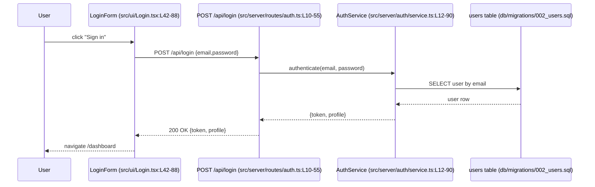
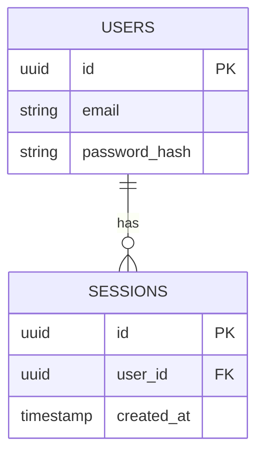

**“Repo Diagrammer: Flows, Events & Knowledge Graph”**

**Variables (edit these as needed):**

- `REPO_ROOT`: `.`
- `INCLUDE_DIRS`: `src, app, server, client, lib`
- `EXCLUDE_GLOBS`: `node_modules, dist, build, .git, .venv, target, coverage, .next, out`
- `PRIMARY_STACK_HINTS`: `typescript react node express redux next fastify jest`
- `SECONDARY_STACK_HINTS`: `python fastapi flask celery sqlalchemy`, `go chi gin`, `java spring`, `ruby rails`, `graphql`, `kafka`, `rabbitmq`, `websocket`
- `OUTPUT_DIR`: `docs/architecture`
- `PII_MARKERS`: `email, ssn, token, password, secret`

**Your role:**
Act as an autonomous “repo cartographer.” You have read‑only access to the file tree and a shell. Your goal is to discover _everything a user can do_ in this application, all events that can trigger flows, and how data moves across functions, modules, services, and storage. Turn that into multiple clear diagrams and a first‑class knowledge graph with backlinks.

**Hard requirements:**

1. **Do not modify source code.** Read‑only.
2. **Be explicit about assumptions.** If something isn’t clear, infer the most likely interpretation and record the assumption in `gaps_and_assumptions.md`.
3. **Cite file paths and line ranges** in every diagram/graph where nodes map to code.
4. **Backlinks required.** For every node/page you generate, include both forward links and computed backlinks.
5. **Keep outputs local under `OUTPUT_DIR` and deterministic.**

**Mermaid hygiene for generated diagrams:**

- Use one Mermaid statement per line; no chained edges on the same line.
- Keep node labels descriptive rather than literal—do not embed `{ key: value }` payloads, GraphQL, or large code fragments.
- When listing fields, prefer natural language separated by commas or semicolons; avoid HTML `<br/>` breaks.
- Escape special characters only when unavoidable; ideally rephrase to stay ASCII‑simple.
- Avoid `style` directives, custom fill colors, or unsupported syntax so diagrams render in Obsidian.

---

### 1) Inventory & static scan

Perform a fast, language‑aware inventory of routes, UI screens, event sources, and data models. Favor AST or structured parsing where possible; fall back to regex/ripgrep if needed.

**Minimum discovery set:**

- **User entry points:** HTTP routes (REST/GraphQL), UI routes, CLI commands, cron/scheduled jobs, WebSocket channels.
- **Event sources:** DOM events, custom event emitters, pub/sub topics, message queues, Redux/Vuex actions, XState machines, observers, `on*` handlers, `emit/publish/dispatch` calls.
- **Event sinks/handlers:** Controllers, handlers, middleware, reducers, sagas/thunks, subscribers, background workers.
- **Data artifacts:** Request/response DTOs, GraphQL types, JSON Schemas, ORM models, SQL migrations, validation layers (zod/yup/joi), serialization.
- **Cross‑module edges:** Imports, DI bindings, service wiring, RPC/gRPC clients, external APIs, storage reads/writes.
- **Security/PII touchpoints:** auth flows, secrets, `PII_MARKERS`.

**Helpful ripgrep patterns (adjust per stack; ignore `EXCLUDE_GLOBS`):**

- Routes/UI: `Route\\(|createBrowserRouter|router\\.|path:|next\\/(app|pages)|getServerSideProps|loaders?\\(|action\\(|useRouter\\(|navigate\\(|Link\\s*to=`
- HTTP: `app\\.(get|post|put|delete|use)\\(|router\\.(get|post|put|delete)\\(|@Get\\(|@Post\\(|FastAPI\\(|@app\\.route`
- Events: `on[A-Z]\\w+\\=|addEventListener\\(|emit\\(|dispatch\\(|publish\\(|subscribe\\(|on\\(|EventEmitter|useEffect\\(|useReducer\\(|createSlice`
- State: `createStore|configureStore|reducer:|useState\\(|useContext\\(|context\\.Provider`
- Data: `schema\\(|z\\.object\\(|yup\\.|Joi\\.|type\\s+\\w+=\\s*{|interface\\s+\\w+\\s*{`
- DB: `SELECT|INSERT|UPDATE|DELETE|createTable\\(|knex\\.|sequelize|TypeORM|Prisma|SQLAlchemy|ActiveRecord`
- Messaging: `kafka|sqs|sns|rabbit|amqp|nats|pubsub|subscribe\\(|consumer|producer`
- Auth: `login|logout|refresh|token|passport|jwt|auth\\(|authorize|policy|rbac|abac`

Emit machine‑readable inventories to:

- `OUTPUT_DIR/inventory/routes.json`
- `OUTPUT_DIR/inventory/events.json`
- `OUTPUT_DIR/inventory/data_models.json`
- `OUTPUT_DIR/inventory/modules.json` (imports/deps)
- `OUTPUT_DIR/inventory/security_touchpoints.json`

Each record must include: `id`, `kind`, `name`, `file`, `lines`, `inferred_stack`, and any `related_ids`.

---

### 2) Flow extraction (what users can do)

From routes, UI screens, commands, and major buttons/links, derive **User Capabilities** as canonical flows:

**For each capability**, produce:

- A short description: _who triggers it, what’s the intent, expected outcome._
- Preconditions/auth requirements.
- **Sequence diagram (Mermaid)** from trigger → handlers → services → storage → response/UI update.
- Inputs/outputs + validation.
- Side‑effects (events published, cache writes, notifications).

Write one file per capability under:

- `OUTPUT_DIR/flows/<capability_slug>.md`

**Mermaid `sequenceDiagram` example (use real names & line refs):**



---

### 3) Event catalog & event‑driven flows

Create `OUTPUT_DIR/events/event_catalog.csv` with columns:
`event_id, name, kind(dom|custom|pubsub|ws|redux|xstate), payload_shape, sources, handlers, publishes, file:lines`

For each major event, generate:

- **Mermaid flowchart** (emitter → bus → handlers).
- If async/messaging: include queue/topic names, partitions/keys if evident.

Store per‑event diagrams in `OUTPUT_DIR/events/diagrams/`.

---

### 4) Data lineage (end‑to‑end)

Trace data elements (esp. user inputs and PII) from source → validation → transformation → persistence → exposure.

Deliverables:

- `OUTPUT_DIR/data/lineage_map.md` with tables:

  - Field | Source | Validated By | Transformed By | Stored In | Exposed Via | Notes

- Per‑field **Mermaid flowchart** showing transformations.
- If SQL/ORM present, also emit an **ER diagram** (`erDiagram`) reflecting actual relations.

**Mermaid `erDiagram` example:**



---

### 5) Knowledge graph with backlinks (modern, queryable)

Build a vendor‑neutral knowledge graph and per‑node backlink pages.

**Graph nodes**: `UserCapability`, `UIRoute`, `APIEndpoint`, `Event`, `Handler`, `Service`, `Job`, `Model`, `Table`, `QueueTopic`, `ExternalAPI`, `ConfigSecret`, `Test`, `Module`.

**Core predicates** (create both directions for backlinks):

- `triggers` / `triggeredBy`
- `handledBy` / `handles`
- `calls` / `calledBy`
- `readsFrom` / `readBy`
- `writesTo` / `writtenBy`
- `publishes` / `publishedBy`
- `subscribesTo` / `subscribedBy`
- `renders` / `renderedBy`
- `validatesWith` / `validates`
- `persistsAs` / `persistedFrom`
- `guards` / `guardedBy`
- `belongsToModule` / `owns`

**Emit in multiple formats:**

- RDF/Turtle: `OUTPUT_DIR/kg/graph.ttl`
- JSON‑LD: `OUTPUT_DIR/kg/graph.jsonld`
- Graphviz DOT: `OUTPUT_DIR/kg/graph.dot`
- Neo4j import (Cypher): `OUTPUT_DIR/kg/neo4j.cypher`

**Turtle snippet template (fill with real IDs and file refs):**

```turtle
@prefix app: <urn:app#> .

app:capability/login a app:UserCapability ;
  app:triggers app:event/LoginClicked ;
  app:handledBy app:api/post_api_login ;
  app:renders app:ui/Dashboard ;
  app:persistsAs app:model/Session ;
  app:source "src/ui/Login.tsx#L42-88" .

app:event/LoginClicked a app:Event ;
  app:publishedBy app:ui/LoginForm ;
  app:payload "{email, password}" ;
  app:source "src/ui/Login.tsx#L42-60" .
```

**Backlink pages:**

- For each node, create `OUTPUT_DIR/kg/pages/<node_id>.md` with:

  - Header, type, file:lines.
  - **Forward links**: list of outgoing edges.
  - **Backlinks**: list of incoming edges (computed).
  - Short “Why it matters”.

Also emit a Markdown index with wiki‑style links:
`OUTPUT_DIR/index/entity_index.md` using `[[node_id]]` links for editor‑level backlink support (Obsidian‑style).

---

### 6) C4 overview (orientation first)

Create:

- `OUTPUT_DIR/00_context.md` — C4 L1 (system context) with a Mermaid `flowchart` showing external actors/systems.
- `OUTPUT_DIR/01_containers.md` — C4 L2 (web app, API, DB, queues).
- `OUTPUT_DIR/02_components.md` — C4 L3 for the most complex container.

---

### 7) Traceability matrix

Create `OUTPUT_DIR/traceability/traceability_matrix.csv` mapping:
`user_capability -> entry_point -> events -> handlers -> data_fields -> storage -> external_dependency -> tests`

This must be derived from your inventories and graphs (no hand‑waving).

---

### 8) Security & PII pass

Generate `OUTPUT_DIR/security/pii_touchpoints.md` listing:

- Where sensitive fields appear (based on `PII_MARKERS` and schema names).
- How they’re validated, logged, stored, and exposed.
- Gaps or risky flows.

---

### 9) How to run & verify locally

At the top of `OUTPUT_DIR/README.md`, include:

- A quick “How to view diagrams” section (Mermaid preview instructions for common editors; Graphviz optional).
- “File map” of deliverables.
- “Assumptions & gaps” link.

---

### 10) Reporting & quality bar

At the end, print a concise summary to the console with counts:

- `N` user capabilities, `R` routes, `E` events, `H` handlers, `M` models/tables, `Q` topics/queues.
- Percentage of routes with sequence diagrams.
- Any high‑risk gaps (auth, PII, missing validation).

If some stacks or tools aren’t present, skip them but note the omission in `gaps_and_assumptions.md`.

---

### Execution notes (pragmatic):

- Prefer AST/structured parsing when available (TypeScript: ts‑morph; Python: `ast`; Go: `go/parser`), else use ripgrep with tight patterns and then refine by reading the matched files.
- Always record `file:lines` for every node/edge you emit.
- Keep diagrams small and focused; for big flows, create per‑subflow diagrams and a parent overview.
- De‑duplicate nodes (stable IDs), normalize names, and generate slugs from real file symbols.
- Do not get stuck: if uncertain, choose the most reasonable path, document the assumption, and move on.

**Deliver everything under** `OUTPUT_DIR` exactly as specified above.
